# Documentação Técnica de Software
## Sistema de Gestão Clínica Abraço
### Especificação de Requisitos de Software (SRS)

**Versão:** 1.0  
**Data:** Julho de 2026  
**Tipo:** Documento de Especificação de Requisitos (baseado em IEEE 830)  
**URL de Produção:** https://clinica-especial.vercel.app

---

## Sumário

1. [Introdução](#1-introdução)
2. [Ecossistema Ágil e Metodologia](#2-ecossistema-ágil-e-metodologia)
3. [Descrição Geral do Sistema](#3-descrição-geral-do-sistema)
4. [Requisitos Funcionais](#4-requisitos-funcionais)
5. [Requisitos Não Funcionais](#5-requisitos-não-funcionais)
6. [Diagrama de Casos de Uso](#6-diagrama-de-casos-de-uso)
7. [Diagrama de Classes / Modelo de Dados](#7-diagrama-de-classes--modelo-de-dados)
8. [Arquitetura do Sistema](#8-arquitetura-do-sistema)
8. [Diagramas de Sequência](#8-diagramas-de-sequência)
9. [Protótipos de Interface](#9-protótipos-de-interface)
10. [Plano de Testes](#10-plano-de-testes)

---

## 1. Introdução

*(ver seção 2 — Ecossistema Ágil — para a metodologia de desenvolvimento adotada)*

---

## 2. Ecossistema Ágil e Metodologia

### 2.1 Abordagem Adotada

O desenvolvimento do Sistema de Gestão Clínica Abraço seguiu os princípios do **desenvolvimento ágil**, com características do **Extreme Programming (XP)** e do **Kanban contínuo**, adaptados ao contexto de um projeto desenvolvido em parceria direta e constante com a clínica.

### 2.2 Princípios Ágeis Aplicados

| Princípio Ágil | Como foi aplicado no projeto |
|---------------|------------------------------|
| **Entrega contínua** | Deploy automático a cada funcionalidade concluída (GitHub → Vercel), sem aguardar "versão final" |
| **Colaboração com o cliente** | Cliente (clínica) participou ativamente de todas as decisões de produto em tempo real |
| **Software funcionando acima de documentação** | Sistema foi para produção desde os primeiros módulos, com uso real pela equipe |
| **Resposta à mudança** | Requisitos foram evoluindo ao longo do desenvolvimento com base no uso real |
| **Feedback rápido** | Cada funcionalidade foi testada pelo cliente imediatamente após a entrega |
| **Integração contínua** | Cada commit passa por verificação automática de tipos (tsc) antes do push |
| **Refatoração constante** | Código revisado em cada ciclo para manter qualidade e remover débito técnico |

### 2.3 Ciclo de Desenvolvimento (Iterações)

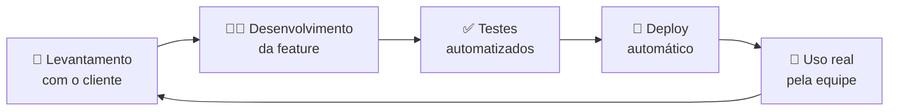

Cada iteração levou entre **horas e alguns dias**, dependendo da complexidade da funcionalidade.

### 2.4 Ferramentas do Ecossistema Ágil

| Ferramenta | Papel no ecossistema |
|-----------|----------------------|
| **GitHub** | Repositório de código + histórico de versões (199 entregas documentadas) |
| **Vercel** | Pipeline de CI/CD — build e deploy automático a cada push |
| **Hook pre-push (tsc)** | Verificação de qualidade — bloqueia push com erros de tipo |
| **Supabase Migrations** | Controle de versão do banco de dados (schema versionado) |
| **Playwright** | Testes end-to-end automatizados nas principais funcionalidades |
| **Chat direto com o cliente** | Backlog e priorização em tempo real |

### 2.5 Entregas por Fase

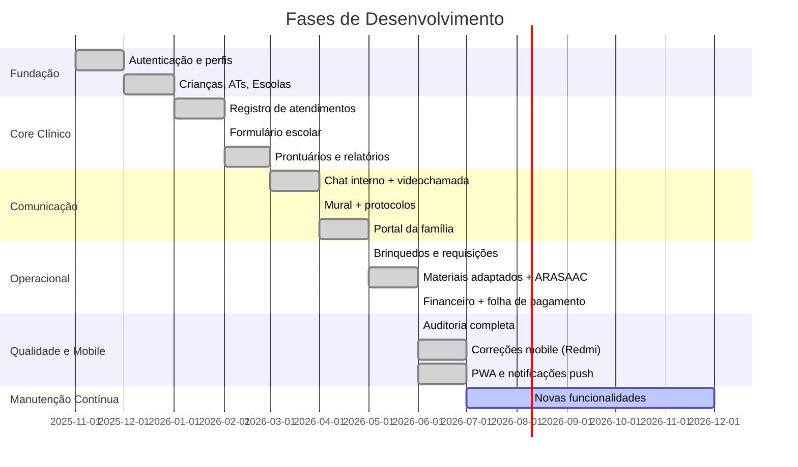

### 2.6 Métricas do Projeto

| Métrica | Valor |
|---------|-------|
| Total de entregas (commits) | 199 |
| Módulos entregues | 20+ |
| Papéis de usuário implementados | 8 |
| Tabelas no banco de dados | 25+ |
| Telas desenvolvidas | 55+ |
| Bugs encontrados e corrigidos | 5 críticos + vários menores |
| Cobertura de verificação de tipos | 100% (TypeScript strict) |

---

## Seções de conteúdo técnico (numeração atualizada)

*(as seções a seguir foram numeradas conforme o sumário)*

---

## 3. Descrição Geral do Sistema

### 1.1 Propósito
Este documento especifica os requisitos de software do **Sistema de Gestão Clínica Abraço**, uma plataforma web para gerenciamento das operações clínicas de uma clínica de terapia ABA (Applied Behavior Analysis — Análise do Comportamento Aplicada).

### 1.2 Escopo
O sistema cobre: gestão de crianças, equipe profissional, atendimentos, comunicação interna, portal da família, módulo financeiro, materiais adaptados, controle de brinquedos, requisições de compra, protocolos de conduta e auditoria de ações.

### 1.3 Definições e Siglas

| Sigla / Termo | Definição |
|---------------|-----------|
| ABA | Applied Behavior Analysis — Análise do Comportamento Aplicada |
| AT | Acompanhante Terapêutico |
| CAA | Comunicação Aumentativa e Alternativa |
| RLS | Row Level Security — segurança em nível de linha no banco de dados |
| PWA | Progressive Web App — aplicativo web instalável |
| SRS | Software Requirements Specification |
| ADM | Administrador do sistema |
| ARASAAC | Portal Aragonês de Comunicação Aumentativa e Alternativa |

### 1.4 Visão Geral do Documento
O documento está organizado do geral para o específico: descrição do negócio → requisitos → diagramas → testes.

---

## 2. Descrição Geral do Sistema

### 2.1 Contexto

A Clínica Abraço é um núcleo de intervenção comportamental ABA que atende crianças com Transtorno do Espectro Autista (TEA) e outras condições do neurodesenvolvimento. Antes do sistema, processos como registro de atendimentos, comunicação interna, controle de materiais e acompanhamento das famílias eram realizados manualmente (planilhas, WhatsApp, cadernos).

O sistema centraliza toda a operação em uma plataforma única acessível por qualquer dispositivo com internet.

### 2.2 Perfis de Usuário (Atores)

| Perfil | Papel no sistema |
|--------|-----------------|
| **adm** | Controle total — gerencia todos os módulos, usuários e auditoria |
| **gestao** | Coordenação clínica — crianças, equipe, agenda, relatórios, escala |
| **supervisora** | Supervisão clínica — comunicados, revisão de materiais adaptados |
| **especialista** | Profissional clínico — escala, prontuários, relatórios de evolução |
| **atendente (AT)** | Campo — registros de atendimento, formulário escolar, materiais |
| **financeiro** | Setor financeiro — contas, folha de pagamento |
| **aux_adm** | Auxiliar administrativo — agenda da diretora, brinquedos |
| **familia** | Responsável da criança — portal de acompanhamento (somente leitura) |

### 2.3 Restrições do Sistema
- Requer conexão com internet para uso pleno
- Autenticação obrigatória para qualquer acesso ao sistema
- Dados devem permanecer em servidor no Brasil (LGPD)
- Interface deve ser responsiva para uso em celulares Android a partir do modelo Pixel 5 (viewport 393px)

---

## 3. Requisitos Funcionais

### RF01 — Autenticação
- RF01.1 O sistema deve permitir login com e-mail e senha
- RF01.2 O sistema deve redirecionar cada perfil para seu dashboard específico após o login
- RF01.3 O sistema deve permitir recuperação de senha por e-mail
- RF01.4 O sistema deve registrar log de auditoria em cada login
- RF01.5 O sistema deve bloquear acesso a rotas não autorizadas para o perfil ativo

### RF02 — Gestão de Crianças
- RF02.1 ADM e Gestão podem cadastrar crianças com: nome, data de nascimento, diagnóstico (CID), escola, série, plano de saúde, número de processo, valor da sessão, responsável, alergias, medicamentos e observações
- RF02.2 O sistema deve listar crianças com filtro por nome e status (ativa/inativa)
- RF02.3 O sistema deve permitir edição e exclusão de dados cadastrais
- RF02.4 O sistema deve vincular crianças a suas equipes (AT, especialistas)

### RF03 — Gestão de Colaboradores
- RF03.1 ADM pode cadastrar ATs com dados pessoais, profissionais e de contato
- RF03.2 ADM pode cadastrar Especialistas com especialidade e registro profissional
- RF03.3 O sistema deve permitir busca por nome e especialidade

### RF04 — Escala de Atendimentos
- RF04.1 O sistema deve exibir escala semanal por profissional, incluindo sábado e domingo
- RF04.2 Escala deve ser visível para: ADM, Gestão, AT, Especialista e Supervisora
- RF04.3 Finais de semana devem ter destaque visual diferenciado (âmbar)

### RF05 — Registro de Atendimento (AT)
- RF05.1 AT pode registrar atendimento informando: criança, data, horário de início e fim
- RF05.2 O sistema deve calcular automaticamente o valor da sessão (R$30/hora padrão)
- RF05.3 AT pode visualizar seu histórico de atendimentos filtrado por mês/ano

### RF06 — Comunicado Diário / Formulário Escolar
- RF06.1 AT deve preencher formulário multi-etapas ao final de cada dia de atendimento escolar
- RF06.2 Formulário deve cobrir: presença, atividades, comportamento, intercorrências e observações
- RF06.3 Gestão e Supervisora visualizam todos os comunicados em tempo real

### RF07 — Prontuários e Relatórios de Evolução
- RF07.1 Especialistas criam e editam prontuários por criança
- RF07.2 Relatórios de evolução devem ficar vinculados à criança e ao autor
- RF07.3 Criação de relatório deve disparar notificação para Gestão e Supervisora

### RF08 — Portal da Família
- RF08.1 Responsável acessa portal com login próprio
- RF08.2 Portal exibe: diário do dia, momentos/fotos, avisos e evolução da criança
- RF08.3 Acesso é somente leitura (família não edita nada)

### RF09 — Chat Interno
- RF09.1 Usuários podem iniciar conversas privadas com colegas autorizados por seu perfil
- RF09.2 Chat deve suportar envio de imagens e arquivos
- RF09.3 Chat deve exibir indicador de digitação em tempo real
- RF09.4 Chat deve exibir indicadores de leitura (✓ / ✓✓)
- RF09.5 Chat deve suportar reações com emoji
- RF09.6 Chat deve oferecer opção de videochamada integrada

### RF10 — Mural de Comunicados
- RF10.1 ADM, Gestão e Supervisora podem publicar avisos no mural
- RF10.2 Toda a equipe visualiza os avisos na tela principal de seu perfil

### RF11 — Protocolos de Conduta
- RF11.1 ADM e Gestão publicam protocolos com texto descritivo
- RF11.2 Cada colaborador deve confirmar leitura do protocolo
- RF11.3 Gestão visualiza relatório de confirmações pendentes e realizadas

### RF12 — Materiais Adaptados
- RF12.1 AT cadastra material com: título, matéria, série, criança (opcional), nível de adaptação, fotos e observações
- RF12.2 AT pode fotografar o material físico pela câmera do celular diretamente pelo sistema
- RF12.3 Sistema deve integrar busca de pictogramas ARASAAC por palavra-chave em português
- RF12.4 AT pode adicionar pictograma ao material com um clique
- RF12.5 Material passa por fluxo: Rascunho → Em Revisão → Aprovado / Ajustes solicitados
- RF12.6 Supervisora e Gestão revisam e aprovam ou solicitam ajustes
- RF12.7 Acervo de materiais aprovados fica disponível para toda a equipe

### RF13 — Sistema de Brinquedos
- RF13.1 Qualquer colaborador pode consultar o catálogo de brinquedos disponíveis
- RF13.2 AT solicita empréstimo de brinquedo
- RF13.3 Sistema controla retirada e devolução com datas
- RF13.4 Sistema exibe ranking de brinquedos mais utilizados

### RF14 — Requisições de Compra
- RF14.1 Qualquer colaborador pode abrir uma requisição de compra informando: produto, quantidade, urgência, link e descrição
- RF14.2 ADM recebe e processa a requisição, podendo aprovar, negar ou atualizar o status
- RF14.3 Status possíveis: Pendente → Em Análise → Aprovado/Negado → Em Compra → Concluído
- RF14.4 Solicitante acompanha o status da sua requisição

### RF15 — Módulo Financeiro
- RF15.1 ADM e Financeiro registram contas a pagar e a receber
- RF15.2 Sistema gera folha de pagamento mensal por colaborador
- RF15.3 Sistema exibe relatórios financeiros por período

### RF16 — Agenda da Diretora
- RF16.1 Auxiliar Administrativo gerencia a agenda de compromissos de Simone (gestão)
- RF16.2 Simone visualiza seus compromissos organizados por dia/semana

### RF17 — Auditoria
- RF17.1 Toda ação crítica (criação, edição, exclusão) deve ser registrada automaticamente
- RF17.2 Log deve conter: data, hora, e-mail do usuário, ação, tabela afetada e descrição
- RF17.3 ADM visualiza log completo com filtros

### RF18 — Notificações Push
- RF18.1 Sistema envia notificações push no celular mesmo com o app fechado
- RF18.2 Notificações são enviadas em eventos como: novo relatório, nova mensagem, novo comunicado

### RF19 — Central de Ajuda
- RF19.1 Sistema disponibiliza guia de uso por perfil acessível dentro da plataforma
- RF19.2 Seção de Materiais Adaptados conta com tutorial específico para ATs

---

## 4. Requisitos Não Funcionais

### RNF01 — Desempenho
- Tempo de carregamento inicial da página: inferior a 3 segundos em rede 4G
- Operações de criação/edição de registros: feedback ao usuário em menos de 2 segundos

### RNF02 — Segurança
- Comunicação exclusivamente via HTTPS (TLS 1.3)
- Autenticação gerenciada pelo Supabase Auth com tokens JWT
- Dados protegidos por RLS (Row Level Security) no banco de dados — cada linha só é acessível pelo usuário autorizado
- Senhas nunca armazenadas em texto plano (hash bcrypt via Supabase Auth)
- Auditoria completa de todas as ações sensíveis

### RNF03 — Usabilidade
- Interface responsiva: funciona em telas de 390px (celular) a 1920px (desktop)
- Design mobile-first: fluxos principais acessíveis em até 3 toques no celular
- Suporte a instalação como PWA (Progressive Web App) no celular

### RNF04 — Disponibilidade
- SLA de disponibilidade: mínimo 99% (garantido pela infraestrutura Vercel + Supabase)
- Sistema de cache via Service Worker para funcionamento offline parcial

### RNF05 — Compatibilidade
- Navegadores: Google Chrome 110+, Firefox 110+, Safari 16+ (iOS)
- Dispositivos: Android 10+ e iOS 15+

### RNF06 — Manutenibilidade
- Código-fonte versionado no GitHub (controle de versão Git)
- Deploy automático a cada atualização via integração GitHub → Vercel
- Banco de dados com histórico de migrations versionadas

### RNF07 — Conformidade Legal
- Dados armazenados em servidor no Brasil (São Paulo — sa-east-1)
- Adequado à LGPD: dados sensíveis protegidos por RLS, sem exposição entre usuários

---

## 5. Diagrama de Casos de Uso

```mermaid
graph TD
    ADM[👤 Administrador]
    GESTAO[👤 Gestão]
    SUPER[👤 Supervisora]
    ESPEC[👤 Especialista]
    AT[👤 Acompanhante Terapêutico]
    FIN[👤 Financeiro]
    AUX[👤 Aux. Administrativo]
    FAM[👤 Família]

    UC1[Gerenciar Crianças]
    UC2[Gerenciar Colaboradores]
    UC3[Visualizar Escala]
    UC4[Registrar Atendimento]
    UC5[Formulário Escolar]
    UC6[Prontuários e Relatórios]
    UC7[Portal da Família]
    UC8[Chat Interno]
    UC9[Mural de Comunicados]
    UC10[Protocolos de Conduta]
    UC11[Materiais Adaptados]
    UC12[Sistema de Brinquedos]
    UC13[Requisições de Compra]
    UC14[Módulo Financeiro]
    UC15[Agenda da Diretora]
    UC16[Auditoria]

    ADM --> UC1
    ADM --> UC2
    ADM --> UC3
    ADM --> UC9
    ADM --> UC10
    ADM --> UC11
    ADM --> UC12
    ADM --> UC13
    ADM --> UC14
    ADM --> UC16

    GESTAO --> UC1
    GESTAO --> UC3
    GESTAO --> UC6
    GESTAO --> UC8
    GESTAO --> UC9
    GESTAO --> UC10
    GESTAO --> UC11
    GESTAO --> UC15

    SUPER --> UC3
    SUPER --> UC6
    SUPER --> UC8
    SUPER --> UC9
    SUPER --> UC11

    ESPEC --> UC3
    ESPEC --> UC6
    ESPEC --> UC8

    AT --> UC3
    AT --> UC4
    AT --> UC5
    AT --> UC8
    AT --> UC11
    AT --> UC12
    AT --> UC13

    FIN --> UC14

    AUX --> UC12
    AUX --> UC15

    FAM --> UC7
```

---

## 6. Diagrama de Classes / Modelo de Dados

### 6.1 Entidades Principais

```mermaid
classDiagram
    class usuarios {
        +uuid id
        +text email
        +text nome
        +user_role role
        +text cpf
        +timestamptz created_at
    }

    class atendentes {
        +uuid id
        +text email
        +text nome
        +user_role role
        +text especialidade
        +text cpf
        +text rg
        +date data_nascimento
        +text whatsapp
        +text endereco
        +text conselho
        +uuid usuario_id FK
    }

    class criancas {
        +uuid id
        +text nome
        +date data_nascimento
        +text diagnostico
        +text cid
        +text plano_saude
        +numeric valor_sessao
        +text modalidade
        +text numero_processo
        +boolean ativo
        +uuid escola_id FK
    }

    class responsaveis {
        +uuid id
        +text nome
        +text email
        +text telefone
        +uuid crianca_id FK
    }

    class escolas {
        +uuid id
        +text nome
        +text endereco
        +text telefone
    }

    class equipe_crianca {
        +uuid id
        +uuid crianca_id FK
        +uuid atendente_id FK
        +text papel
    }

    class atendimentos {
        +uuid id
        +uuid crianca_id FK
        +uuid atendente_id FK
        +date data
        +time hora_inicio
        +time hora_fim
        +numeric valor
        +text observacoes
    }

    class formularios_escolares {
        +uuid id
        +uuid crianca_id FK
        +uuid atendente_id FK
        +date data
        +text presenca
        +text atividades
        +text comportamento
        +text observacoes
    }

    class prontuarios {
        +uuid id
        +uuid crianca_id FK
        +uuid autor_id FK
        +text tipo
        +text conteudo
        +timestamptz created_at
    }

    class materiais_adaptados {
        +uuid id
        +text titulo_livro
        +text materia
        +text serie
        +uuid crianca_id FK
        +text nivel_adaptacao
        +text[] fotos
        +text status
        +text observacao_revisao
        +uuid criado_por FK
    }

    class mensagens_chat {
        +uuid id
        +uuid conversa_id FK
        +uuid autor_id FK
        +text texto
        +text arquivo_url
        +timestamptz created_at
    }

    class mural {
        +uuid id
        +text titulo
        +text conteudo
        +text autor_nome
        +text[] roles_destino
        +timestamptz created_at
    }

    class brinquedos_emprestimos {
        +uuid id
        +text brinquedo_nome
        +uuid solicitante_id FK
        +text status
        +date data_retirada
        +date data_devolucao
    }

    class requisicoes_compra {
        +uuid id
        +text produto
        +int quantidade
        +text urgencia
        +text status
        +text solicitante_nome
        +text obs_adm
    }

    class log_auditoria {
        +uuid id
        +text usuario_email
        +text acao
        +text tabela
        +uuid registro_id
        +text descricao
        +timestamptz created_at
    }

    criancas --> escolas : escola_id
    criancas --> responsaveis : 1 para N
    equipe_crianca --> criancas : crianca_id
    equipe_crianca --> atendentes : atendente_id
    atendimentos --> criancas : crianca_id
    atendimentos --> atendentes : atendente_id
    formularios_escolares --> criancas : crianca_id
    formularios_escolares --> atendentes : atendente_id
    prontuarios --> criancas : crianca_id
    materiais_adaptados --> criancas : crianca_id (opcional)
    mensagens_chat --> atendentes : autor_id
```

### 6.2 Enum de Papéis (user_role)

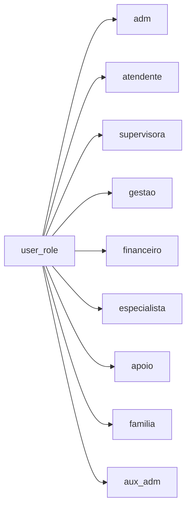

---

## 7. Arquitetura do Sistema

### 7.1 Visão Geral das Camadas

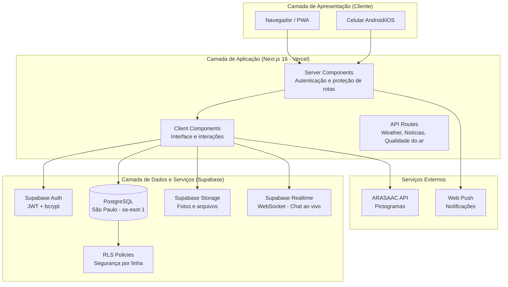

### 7.2 Stack Tecnológico

| Camada | Tecnologia | Versão |
|--------|-----------|--------|
| Framework Frontend | Next.js (App Router) | 16.x |
| Linguagem | TypeScript | 5.x |
| Estilização | Tailwind CSS | 4.x |
| Backend / BaaS | Supabase | — |
| Banco de dados | PostgreSQL (via Supabase) | 15 |
| Autenticação | Supabase Auth | — |
| Storage de arquivos | Supabase Storage | — |
| Realtime/WebSocket | Supabase Realtime | — |
| Hospedagem | Vercel | — |
| Controle de versão | Git / GitHub | — |

### 7.3 Fluxo de Deploy

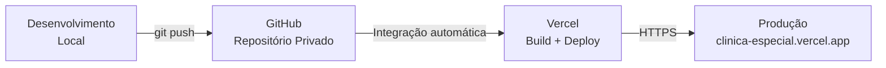

---

## 8. Diagramas de Sequência

### 8.1 Fluxo de Login

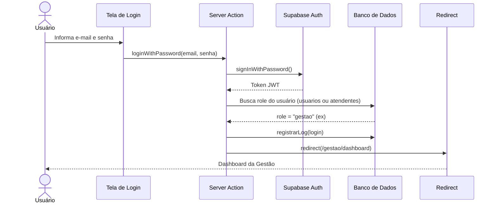

### 8.2 Fluxo de Registro de Atendimento (AT)

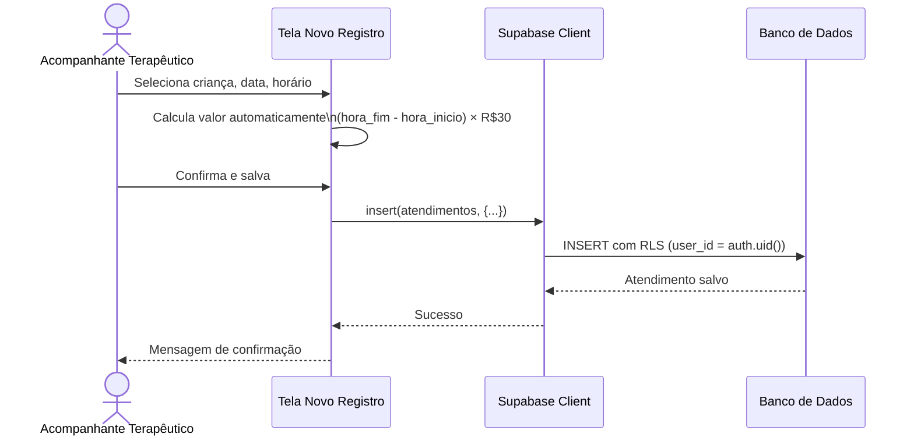

### 8.3 Fluxo de Aprovação de Material Adaptado

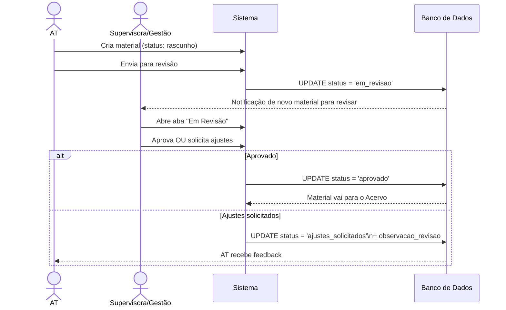

### 8.4 Fluxo de Busca de Pictogramas ARASAAC

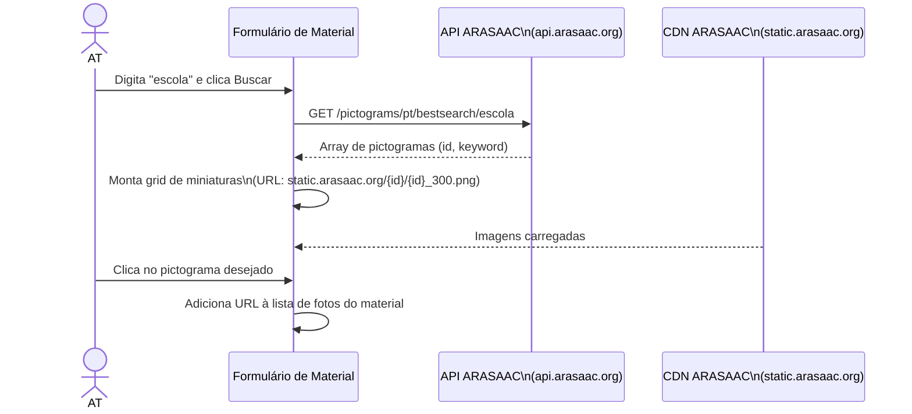

---

## 9. Protótipos de Interface

### 9.1 Tela de Login

```
┌─────────────────────────────────────┐
│                                     │
│         [LOGO CLÍNICA ABRAÇO]       │
│           Clínica Abraço            │
│     ABA — Intervenção Comportamental│
│                                     │
│   ─────────────────────────────     │
│   Acessar sistema                   │
│   Use suas credenciais da clínica.  │
│                                     │
│   E-MAIL                            │
│   [📧 nome@clinicaabraco.com    ]   │
│                                     │
│   SENHA                             │
│   [🔒 ••••••••                  ]   │
│                              Esqueci│
│                                     │
│   [          Entrar           ]     │
│                                     │
└─────────────────────────────────────┘
```

### 9.2 Dashboard do Administrador (desktop)

```
┌─────────────────┬──────────────────────────────────────────┐
│ CLÍNICA ABRAÇO  │  Dashboard Administrador                  │
│ ─────────────── │                                          │
│ 📊 Dashboard    │  ┌──────┐  ┌──────┐  ┌──────┐  ┌──────┐│
│ 👶 Crianças     │  │  32  │  │  18  │  │  156 │  │  12  ││
│ 🏫 Escolas      │  │Crianç│  │ ATs  │  │ Aten.│  │Pendên││
│ 👥 ATs          │  │ Ativas│  │      │  │/mês  │  │  tes ││
│ 🎓 Especialistas│  └──────┘  └──────┘  └──────┘  └──────┘│
│ 💰 Financeiro   │                                          │
│ 📋 Protocolos   │  Últimos atendimentos...                 │
│ 📊 Auditoria    │  Comunicados recentes...                 │
│ 🧸 Brinquedos   │                                          │
│ 🛒 Requisições  │                                          │
│ 📚 Materiais    │                                          │
│ 💬 Chat         │                                          │
│ [Sair]          │                                          │
└─────────────────┴──────────────────────────────────────────┘
```

### 9.3 Tela do AT (celular) — Navegação inferior

```
┌──────────────────────┐
│ Meus Atendimentos    │
│                      │
│ ← Junho 2026 →       │
│                      │
│ ┌────────────────┐   │
│ │ 23/06 - João   │   │
│ │ 08h–10h = R$60 │   │
│ └────────────────┘   │
│ ┌────────────────┐   │
│ │ 24/06 - Maria  │   │
│ │ 14h–16h = R$60 │   │
│ └────────────────┘   │
│                      │
├──────────────────────┤
│ 📝  📋  📄  📅  🧸  │
│ Reg Aten Com  Esc Bri│
└──────────────────────┘
```

### 9.4 Painel de Materiais Adaptados — Modal de cadastro

```
┌────────────────────────────────┐
│ Novo material adaptado      ✕  │
│ ─────────────────────────────  │
│ TÍTULO DO LIVRO/MATERIAL *     │
│ [Histórias em Quadrinhos—Cap.3]│
│                                │
│ MATÉRIA          SÉRIE/ANO     │
│ [Português   ]   [4º ano   ]   │
│                                │
│ CRIANÇA (OPCIONAL)             │
│ [Material geral do acervo  ▾]  │
│                                │
│ NÍVEL DE ADAPTAÇÃO             │
│ [Pictogramas / CAA         ▾]  │
│                                │
│ 🔎 BUSCAR PICTOGRAMAS (ARASAAC)│
│ [escola, comer, feliz...] Buscar│
│ [🏫][🚪][🖥️][📚][✏️][👩‍🏫]     │
│                                │
│ FOTOS DO MATERIAL              │
│ [📷 Tirar foto] [🖼️ Galeria ]  │
│                                │
│ [💾 Rascunho] [📤 Enviar rev.] │
└────────────────────────────────┘
```

---

## 10. Plano de Testes

### 10.1 Estratégia de Testes

O sistema adota uma estratégia de **testes manuais funcionais** combinada com **verificação automatizada de tipos (TypeScript)** e **checagem de build antes de cada deploy** (hook pre-push via script shell).

### 10.2 Tipos de Testes Realizados

| Tipo | Ferramenta | Quando |
|------|-----------|--------|
| Verificação de tipos | tsc --noEmit | A cada git push (hook automático) |
| Teste end-to-end | Playwright (headless Chromium) | A cada feature principal implantada |
| Teste de regressão visual | Screenshots via Playwright | Após mudanças de layout |
| Teste de usabilidade móvel | Emulação Pixel 5 (Playwright) | Features críticas para o celular |
| Teste de acessibilidade ao banco | Script Node.js + Supabase SDK | Validação de migrations |

### 10.3 Casos de Teste Principais

#### CT-01: Login com credenciais válidas
- **Pré-condição:** Usuário cadastrado no Supabase Auth
- **Entrada:** e-mail e senha corretos
- **Resultado esperado:** Redirect para dashboard do perfil correto
- **Resultado obtido:** ✅ Aprovado

#### CT-02: Login com credenciais inválidas
- **Entrada:** e-mail ou senha incorretos
- **Resultado esperado:** Mensagem "E-mail ou senha incorretos" — sem redirect
- **Resultado obtido:** ✅ Aprovado

#### CT-03: Acesso a rota não autorizada
- **Pré-condição:** Logado como AT
- **Entrada:** Navegar diretamente para `/adm/auditoria`
- **Resultado esperado:** Redirect para `/login`
- **Resultado obtido:** ✅ Aprovado

#### CT-04: Registro de atendimento
- **Entrada:** AT seleciona criança, 08h00–10h00
- **Resultado esperado:** Atendimento salvo, valor = R$60,00
- **Resultado obtido:** ✅ Aprovado

#### CT-05: Busca de pictogramas ARASAAC
- **Entrada:** Termo "escola"
- **Resultado esperado:** Grid com até 12 pictogramas renderizados
- **Resultado obtido:** ✅ Aprovado (3 resultados reais retornados pela API)

#### CT-06: Fluxo de aprovação de material adaptado
- **Etapas:** Cadastrar → Enviar para revisão → Supervisora aprova
- **Resultado esperado:** Status passa de "em_revisao" para "aprovado"
- **Resultado obtido:** ✅ Aprovado

#### CT-07: Chat em tempo real
- **Entrada:** Usuário A envia mensagem para Usuário B
- **Resultado esperado:** Mensagem aparece no chat de B sem precisar recarregar a página
- **Resultado obtido:** ✅ Aprovado (WebSocket via Supabase Realtime)

#### CT-08: Responsividade móvel
- **Entrada:** Acesso via celular (Pixel 5, 393px)
- **Resultado esperado:** Header fixo abaixo da barra superior, botões acessíveis, modais funcionando
- **Resultado obtido:** ✅ Aprovado (após correção do bug de sobreposição do header fixo)

#### CT-09: Proteção contra acesso cruzado de dados (RLS)
- **Entrada:** Usuário A tenta acessar prontuários de criança não vinculada a ele
- **Resultado esperado:** Retorno vazio ([] ou 0 registros)
- **Resultado obtido:** ✅ Aprovado (RLS bloqueia no nível do banco)

#### CT-10: Hook pre-push de TypeScript
- **Entrada:** git push com erro de tipo no código
- **Resultado esperado:** Push bloqueado com mensagem "❌ Push bloqueado: erros de tipo encontrados"
- **Resultado obtido:** ✅ Aprovado

### 10.4 Bugs Encontrados e Corrigidos

| ID | Descrição | Módulo | Status |
|----|-----------|--------|--------|
| BUG-01 | Header fixo mobile sobrepondo botões de ação em todas as páginas | Layout | ✅ Corrigido |
| BUG-02 | Query de transações do mês sem limite superior de data (incluía meses futuros) | Financeiro | ✅ Corrigido |
| BUG-03 | Feedback de erro da busca ARASAAC invisível (modal cobria o toast de erro) | Materiais | ✅ Corrigido |
| BUG-04 | PWA com estratégia cache-first travando sistema em versão antiga após deploys | PWA | ✅ Corrigido |
| BUG-05 | Sábado e domingo ausentes na escala da atendente | Escala | ✅ Corrigido |

---

## Apêndice A — Estrutura de Rotas

| Rota | Perfil(s) | Módulo |
|------|-----------|--------|
| `/login` | Todos | Autenticação |
| `/adm/dashboard` | adm | Dashboard ADM |
| `/adm/criancas` | adm | Crianças |
| `/adm/atendentes` | adm | ATs |
| `/adm/especialistas` | adm | Especialistas |
| `/adm/escolas` | adm | Escolas |
| `/adm/responsaveis` | adm | Responsáveis |
| `/adm/financeiro` | adm, financeiro | Financeiro |
| `/adm/folha-pagamento` | adm, financeiro | Folha de pagamento |
| `/adm/protocolos` | adm | Protocolos |
| `/adm/auditoria` | adm | Auditoria |
| `/adm/brinquedos` | adm | Brinquedos |
| `/adm/requisicoes` | adm | Requisições |
| `/adm/mural` | adm | Mural |
| `/gestao/dashboard` | gestao | Dashboard gestão |
| `/gestao/criancas` | gestao | Crianças |
| `/gestao/atendentes` | gestao | ATs |
| `/gestao/especialistas` | gestao | Especialistas |
| `/gestao/escolas` | gestao | Escolas |
| `/gestao/agenda` | gestao | Agenda clínica |
| `/gestao/escala` | gestao | Escala |
| `/gestao/relatorios` | gestao | Relatórios |
| `/gestao/mural` | gestao | Mural |
| `/especialista` | especialista | Área do especialista |
| `/especialista/prontuarios` | especialista | Prontuários |
| `/especialista/relatorio` | especialista | Relatórios de evolução |
| `/especialista/escala` | especialista | Escala |
| `/atendente/novo-registro` | atendente | Registro de atendimento |
| `/atendente/meus-atendimentos` | atendente | Histórico |
| `/atendente/formulario-escolar` | atendente | Comunicado diário |
| `/atendente/escala` | atendente | Escala |
| `/auxiliar/agenda` | aux_adm | Agenda da diretora |
| `/auxiliar/brinquedos` | aux_adm | Brinquedos |
| `/supervisora/comunicados` | supervisora | Comunicados |
| `/familia` | familia | Portal da família |
| `/chat` | Todos (exceto familia) | Chat interno |
| `/mural` | Todos (exceto familia) | Mural |
| `/escala` | AT, Especialista | Escala compartilhada |
| `/protocolos` | Todos (exceto familia) | Protocolos |
| `/brinquedos` | Todos (exceto familia) | Brinquedos |
| `/requisicoes` | Todos (exceto familia) | Requisições |
| `/materiais-adaptados` | AT, Supervisora, Gestão, ADM | Materiais |
| `/ajuda` | Todos | Central de ajuda |

---

*Documento elaborado em julho de 2026.*
*Sistema desenvolvido em parceria com a Clínica Abraço — ABA Núcleo de Intervenção Comportamental.*
*Total de versões entregues: 199 commits (histórico completo disponível no GitHub).*
